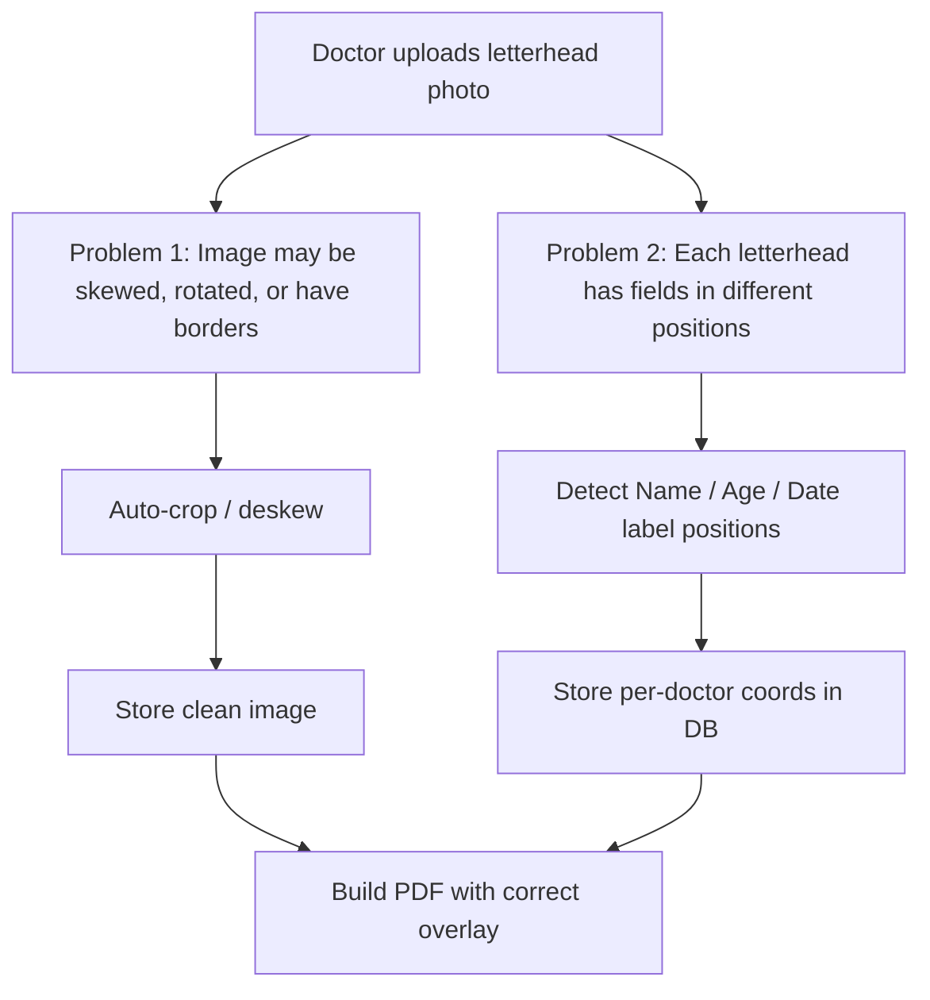
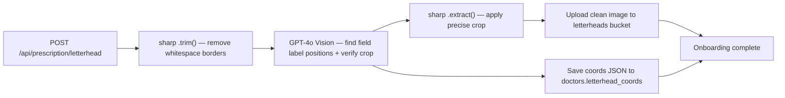
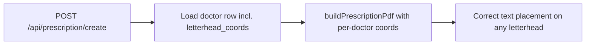

# Future Plan: Letterhead AI Processing

## Overview

Add auto-crop and AI-powered field-coordinate detection to the letterhead onboarding flow, so every doctor's letterhead — regardless of how it was photographed — gets properly cropped and has its patient-info fields (Name, Age, Date, etc.) automatically located for accurate PDF text overlay.

---

## Current State

- Letterhead is uploaded once per doctor at onboarding (`/api/prescription/letterhead`)
- PDF is built in `lib/pdf/prescription.ts` using **hardcoded fractional coords** in `lib/pdf/coords.ts` tuned only for "Shifa Clinic A4 letterhead"
- Every other clinic's letterhead will have fields in different positions — the text overlay will land in the wrong place
- No cropping or perspective correction exists anywhere

---

## Two Problems to Solve



---

## Solution Options

### Option A — GPT-4o Vision (Recommended, one API call does both jobs)

One API call to OpenAI with the uploaded image asks:
1. Where is the document boundary? (returns bounding box → used to crop)
2. Where are the printed labels "Name", "Age/Date of Birth", "Date", "Mobile/Phone"? (returns fractional x/y per label → stored as per-doctor coords)

**Pros:** No extra libraries, handles tilted photos, works on any language letterhead, already have `OPENAI_API_KEY` in env.
**Cons:** Costs ~$0.002–0.005 per upload (one-time at onboarding). Requires internet at upload time.

**Flow:**
- `app/api/prescription/letterhead/route.ts` — after upload, call GPT-4o with the image
- GPT returns JSON: `{ crop: {x,y,w,h}, fields: { name: {x,y}, age: {x,y}, date: {x,y}, mobile: {x,y} } }`
- `sharp` applies the crop, stores clean image back to `letterheads` bucket
- Field coords saved to a new `doctors.letterhead_coords` JSONB column
- `lib/pdf/prescription.ts` uses per-doctor coords instead of hardcoded `lib/pdf/coords.ts`

---

### Option B — sharp (auto-trim only, no field detection)

`sharp`'s `.trim()` removes uniform-color borders automatically. Good for scanned images but **fails on photos taken at an angle**.

```js
sharp(buffer).trim({ background: '#ffffff', threshold: 10 }).toBuffer()
```

**Pros:** Zero cost, zero latency, no external API.
**Cons:** Doesn't fix perspective/skew. Doesn't solve the coord-per-letterhead problem — all doctors still share the same hardcoded coords, which is wrong.

Best used as a **pre-processing step before Option A**, not as a standalone solution.

---

### Option C — Google Vision API (Document detection + OCR)

Google's `DOCUMENT_TEXT_DETECTION` finds printed text and its bounding boxes. Crop via `cropHints`. More accurate OCR than GPT-4o for structured text.

**Pros:** Very precise bounding boxes, works offline from OpenAI.
**Cons:** Requires a separate Google Cloud credential (beyond the Calendar service account). More complex to parse.

---

### Option D — Tesseract.js (fully local OCR)

Runs OCR in Node with no external API. Finds text labels and their positions.

**Pros:** Free, no API key.
**Cons:** Much slower (~5–15s per image), lower accuracy on rotated/low-res photos. Doesn't do perspective correction.

---

## Recommended Approach: A + B combined



At prescription creation time:



---

## Changes Required

### 1. Database — new column

Add `letterhead_coords JSONB` column to `doctors` table.

```sql
ALTER TABLE public.doctors
  ADD COLUMN IF NOT EXISTS letterhead_coords JSONB DEFAULT NULL;
```

---

### 2. New utility — `lib/pdf/detectLetterheadFields.ts`

Calls GPT-4o with the image bytes (base64) and returns typed `LetterheadCoords` matching the existing `PrescriptionCoords` shape.

```ts
import OpenAI from "openai";
import { PRESCRIPTION_COORDS, PrescriptionCoords } from "./coords";

const client = new OpenAI();

const SYSTEM_PROMPT = `
You are a document layout analyser.
Given a clinic letterhead image, return a JSON object with this exact shape:
{
  "crop": { "x": number, "y": number, "w": number, "h": number },
  "fields": {
    "name":   { "xFrac": number, "yFrac": number },
    "age":    { "xFrac": number, "yFrac": number },
    "date":   { "xFrac": number, "yFrac": number },
    "mobile": { "xFrac": number, "yFrac": number },
    "testsStart": { "xFrac": number, "yFrac": number }
  }
}
- crop: pixel bounding box of the actual document (remove background/borders).
- fields: fractional position (0–1) of WHERE TO WRITE the value next to each label.
  Place each value just to the right of its printed label colon.
  If a label is not found, use null.
Return ONLY valid JSON, no markdown.
`;

export async function detectLetterheadFields(
  imageBytes: Buffer,
  mimeType: "image/png" | "image/jpeg"
): Promise<{ coords: PrescriptionCoords; crop: { x: number; y: number; w: number; h: number } | null }> {
  const base64 = imageBytes.toString("base64");

  const response = await client.chat.completions.create({
    model: "gpt-4o",
    max_tokens: 512,
    messages: [
      { role: "system", content: SYSTEM_PROMPT },
      {
        role: "user",
        content: [
          {
            type: "image_url",
            image_url: { url: `data:${mimeType};base64,${base64}`, detail: "high" },
          },
          { type: "text", text: "Analyse this letterhead and return the JSON." },
        ],
      },
    ],
  });

  const raw = response.choices[0]?.message?.content ?? "";

  try {
    const parsed = JSON.parse(raw);
    const f = parsed.fields ?? {};

    const coords: PrescriptionCoords = {
      name:       f.name       ?? PRESCRIPTION_COORDS.name,
      age:        f.age        ?? PRESCRIPTION_COORDS.age,
      date:       f.date       ?? PRESCRIPTION_COORDS.date,
      mobile:     f.mobile     ?? PRESCRIPTION_COORDS.mobile,
      testsStart: f.testsStart ?? PRESCRIPTION_COORDS.testsStart,
    };

    return { coords, crop: parsed.crop ?? null };
  } catch {
    // GPT response unparseable — return safe defaults
    return { coords: PRESCRIPTION_COORDS, crop: null };
  }
}
```

---

### 3. Updated — `app/api/prescription/letterhead/route.ts`

After the existing upload, add:

```ts
import sharp from "sharp";
import { detectLetterheadFields } from "@/lib/pdf/detectLetterheadFields";

// --- after successful upsert to storage ---

const fileBytes = Buffer.from(await file.arrayBuffer());

// Step 1: sharp pre-trim (removes solid-color borders cheaply)
const preTrimmed = await sharp(fileBytes)
  .trim({ background: "#ffffff", threshold: 15 })
  .toBuffer();

// Step 2: GPT-4o — detect field positions + precise crop bounding box
const mime = ext === "png" ? "image/png" : "image/jpeg";
const { coords, crop } = await detectLetterheadFields(preTrimmed, mime);

// Step 3: if GPT found a crop box, apply it
let finalBytes = preTrimmed;
if (crop) {
  finalBytes = await sharp(preTrimmed)
    .extract({ left: crop.x, top: crop.y, width: crop.w, height: crop.h })
    .toBuffer();
  // Re-upload the clean cropped image
  await supabase.storage.from("letterheads").upload(storagePath, finalBytes, {
    contentType: mime,
    upsert: true,
  });
}

// Step 4: save coords to doctors row
await supabase
  .from("doctors")
  .update({ letterhead_coords: coords })
  .eq("id", user.id);
```

---

### 4. Updated — `app/api/prescription/create/route.ts`

```ts
// In doctor select, add letterhead_coords
const { data: doctor } = await supabase
  .from("doctors")
  .select("full_name, clinic_name, phone, letterhead_path, letterhead_coords")
  .eq("id", user.id)
  .single();

// Pass coords (or null to use defaults) into the PDF builder
const pdfBytes = await buildPrescriptionPdf({
  ...existingInput,
  coords: doctor.letterhead_coords ?? undefined,
});
```

---

### 5. Updated — `lib/pdf/prescription.ts`

```ts
import { PRESCRIPTION_COORDS, PrescriptionCoords } from "./coords";

export interface PrescriptionInput {
  // ... existing fields ...
  coords?: Partial<PrescriptionCoords>; // per-doctor override, falls back to defaults
}

export async function buildPrescriptionPdf(input: PrescriptionInput): Promise<Uint8Array> {
  const coords = { ...PRESCRIPTION_COORDS, ...input.coords };
  // use `coords.name.xFrac`, `coords.age.yFrac`, etc. everywhere
}
```

---

### 6. Updated — `app/prescription/onboarding/page.tsx`

- After `fetch("/api/prescription/letterhead", ...)` succeeds, show a **"Analysing your letterhead…"** spinner (GPT call happens server-side during the same request)
- On completion, show the **cropped letterhead preview** with coloured dot markers at each detected field position
- If detection failed, show a soft warning banner instead of blocking the flow

---

## Dependencies to Install

```bash
npm install openai
```

`sharp` is already installed.

---

## Fallback Strategy

If GPT-4o fails (network error, unparseable JSON, quota exceeded):
1. Fall back to `PRESCRIPTION_COORDS` defaults from `lib/pdf/coords.ts`
2. Doctor still lands on the prescription page — upload succeeds regardless
3. UI shows: "We couldn't auto-detect your letterhead fields. Text positions may need manual adjustment."
4. `letterhead_coords` stays `NULL` in DB — `create` route falls back to defaults silently

---

## Task Checklist

- [ ] Run `ALTER TABLE doctors ADD COLUMN letterhead_coords JSONB DEFAULT NULL` in Supabase SQL editor
- [ ] Install `openai` npm package
- [ ] Create `lib/pdf/detectLetterheadFields.ts`
- [ ] Update `app/api/prescription/letterhead/route.ts`
- [ ] Update `app/api/prescription/create/route.ts`
- [ ] Update `lib/pdf/prescription.ts` to accept optional `coords` param
- [ ] Update `app/prescription/onboarding/page.tsx` with spinner + preview markers
- [ ] Add `OPENAI_API_KEY` to Netlify environment variables

---

# Voice-to-Prescription — Phase 2 (AssemblyAI + OpenAI gpt-4o-mini)

## Context

Phase 1 (shipped) uses **AssemblyAI only** — transcription plus its built-in
`entity_detection` for names and phone numbers, supplemented by local regex
(age, mobile) and a keyword map (diagnostic test IDs). This works for clean,
well-structured dictations like:

> "Patient name Rahul Sharma, age 45, mobile 9876543210, advise CBC, lipid
> profile, and ECG."

It struggles when doctors:

- Speak in mixed Hindi/English (code-switching).
- Mention tests with unusual phrasing not in the keyword map.
- Include extra context ("he's been hypertensive for 5 years, let's also do
  a KFT and uric acid").
- Say names AssemblyAI doesn't recognize as `person_name`.
- Need the extractor to disambiguate multiple numbers (age vs mobile vs dosage).

Phase 2 upgrades extraction to an LLM while keeping AssemblyAI for the
transcription step.

## Why gpt-4o-mini (and not Claude)

| Criterion | gpt-4o-mini | Claude 3.5 Haiku |
|-----------|-------------|-------------------|
| Cost per 1M input tokens | $0.15 | $0.80 |
| Cost per 1M output tokens | $0.60 | $4.00 |
| Structured JSON output | Native `response_format: { type: "json_object" }` | Tool use required |
| Latency (P50) | ~800ms for 500-token completion | ~1200ms |
| Alignment with future OCR | Same API key powers GPT-4o Vision for letterhead OCR (see first plan) | Would need a second key |

Estimated cost per prescription extraction: **~$0.0003** (≈ Rs 0.025). Even at
10,000 prescriptions/month this is **Rs 250/month** — negligible.

## Architecture

```
Mic → MediaRecorder → base64 ──► /api/prescription/transcribe
                                        │
                                        ├── AssemblyAI (universal model)
                                        │     └── returns transcript text
                                        │
                                        └── OpenAI gpt-4o-mini
                                              └── returns validated JSON
                                                  { patientName, patientAge,
                                                    patientMobile, testIds,
                                                    notes }
                                        │
                                        ▼
                                  Zod validation
                                        │
                                        ▼
                                   React form setValue
```

## Implementation

### 1. Dependencies

```bash
npm install openai
```

### 2. Environment

```bash
# .env.local
ASSEMBLYAI_API_KEY=...       # already added
OPENAI_API_KEY=sk-proj-...   # new
```

### 3. Extractor upgrade (`lib/voice/extract.ts`)

Replace the regex + keyword-map body with an OpenAI call:

```ts
import OpenAI from "openai";
import { z } from "zod";
import { DIAGNOSTIC_TESTS } from "@/lib/data/diagnosticTests";

const ExtractionSchema = z.object({
  patientName: z.string().nullable(),
  patientAge: z.number().int().min(0).max(120).nullable(),
  patientMobile: z.string().regex(/^[6-9]\d{9}$/).nullable(),
  testIds: z.array(z.string()),
  notes: z.string().nullable(),
});

const TEST_CATALOG = DIAGNOSTIC_TESTS.map(
  (t) => `- ${t.id}: ${t.label} (${t.category})`,
).join("\n");

const SYSTEM_PROMPT = `You extract structured prescription fields from a doctor's
voice note transcript. Return ONLY valid JSON matching this schema:

{
  "patientName": string | null,      // Title Case, no honorifics
  "patientAge": number | null,       // 0-120, integer years
  "patientMobile": string | null,    // Exactly 10 digits, starts with 6-9 (Indian)
  "testIds": string[],               // IDs from the catalog below
  "notes": string | null             // Any other clinical context worth preserving
}

Rules:
- If a field is not clearly stated, return null (empty array for testIds).
- Never invent a mobile number. 10 digits only, strip country codes.
- Match spoken test names to the catalog IDs. Include every test mentioned.
- Be conservative: when in doubt, return null rather than guess.

TEST CATALOG (use these exact IDs):
${TEST_CATALOG}`;

export async function extractFields(transcript: string) {
  const client = new OpenAI({ apiKey: process.env.OPENAI_API_KEY });

  const completion = await client.chat.completions.create({
    model: "gpt-4o-mini",
    temperature: 0,
    response_format: { type: "json_object" },
    messages: [
      { role: "system", content: SYSTEM_PROMPT },
      { role: "user", content: transcript },
    ],
  });

  const raw = completion.choices[0]?.message?.content ?? "{}";
  const parsed = ExtractionSchema.safeParse(JSON.parse(raw));
  if (!parsed.success) {
    throw new Error("LLM returned invalid JSON");
  }

  const valid = new Set(DIAGNOSTIC_TESTS.map((t) => t.id));
  return {
    ...parsed.data,
    testIds: parsed.data.testIds.filter((id) => valid.has(id)),
  };
}
```

### 4. API route change

`app/api/prescription/transcribe/route.ts` — swap the synchronous regex
extractor for the async OpenAI one, keep AssemblyAI transcription. Entity
detection can be disabled (save cost) since the LLM handles extraction.

### 5. No frontend changes

`VoiceRecorder.tsx` and `useVoiceRecorder.ts` don't change — they already
expect `{ transcript, patientName, patientAge, patientMobile, testIds }`
from the API. Only the server-side implementation changes.

## Rollout plan

1. Ship Phase 1 (done) — validate UX and collect real transcripts.
2. Log 20–30 real transcripts (with consent) to test extraction quality.
3. Run both extractors in parallel (shadow mode) — log divergence cases.
4. Flip traffic to gpt-4o-mini behind a `FEATURE_VOICE_LLM=1` env flag.
5. Keep regex extractor as automatic fallback if OpenAI returns 5xx/429.

## Future Phase 3 ideas

- **Streaming transcription** via AssemblyAI Realtime WebSocket for live
  interim text as the doctor speaks.
- **Hindi/English code-switch** — AssemblyAI supports `language_code: "hi"`
  + translate step, or use Whisper large-v3 via Groq (faster + Hindi-capable).
- **Voice-only confirmation** — read extracted values back via TTS and let
  doctor say "confirm" or "change age to 52" without touching the form.
- **Embeddings-based test matcher** — replace keyword map with a vector
  search over test labels for better recall on synonyms and typos.

## Task Checklist (Phase 2)

- [ ] Install `openai` npm package
- [ ] Add `OPENAI_API_KEY` to `.env.local` + Netlify env
- [ ] Replace `lib/voice/extract.ts` with LLM extractor (keep regex as fallback)
- [ ] Update `app/api/prescription/transcribe/route.ts` to await new extractor
- [ ] Add shadow-mode logging for 2 weeks before full cutover
- [ ] Document cost monitoring in `lib/metrics/` (optional)

---

# Photo Scan → Prescription Form Auto-Fill

## Overview

A doctor writes patient details (name, age, mobile, diagnostic tests) on any
paper slip, clicks a photo, attaches it on the prescription form, and the
system reads the handwriting and auto-fills every field — exactly like the
voice recorder, but triggered by an image.

## Flow

```
Doctor writes slip
       │
       ▼
"Scan Paper" button on /prescription/new
       │
       ├── Mobile → camera opens directly (capture="environment")
       └── Desktop → file picker opens
       │
       ▼
Client-side compression (Canvas API, no new library)
  Original photo ~4 MB → 1024px JPEG @0.85 → ~150 KB → base64
       │
       ▼
POST /api/prescription/scan  { imageBase64, mimeType }
       │
       ├── Auth guard (same as transcribe route)
       ├── GPT-4o Vision reads handwriting
       ├── Returns JSON { patientName, patientAge, patientMobile, testIds, notes }
       └── Zod validation + filter testIds against DIAGNOSTIC_TESTS catalog
       │
       ▼
form.setValue() auto-fills form fields
"Scanned" teal badges appear (same pattern as "Added by voice" badges)
```

## New environment variable

```bash
# .env.local  +  Netlify environment variables
OPENAI_API_KEY=sk-proj-...
```

Also add placeholder to `.env.example`:
```
# --- OpenAI (image scan OCR) ---
OPENAI_API_KEY=
```

## Files to create

### `app/api/prescription/scan/route.ts`

New auth-guarded API route. Mirrors `app/api/prescription/transcribe/route.ts`
in structure.

- Accept `{ imageBase64: string, mimeType: string }` in body
- Strip data URI prefix, validate ≤5 MB
- Call **GPT-4o Vision** with a structured system prompt containing the full
  test catalog, requesting JSON output
- Validate response with Zod, filter `testIds` against `DIAGNOSTIC_TESTS`
- Return same `ExtractedFieldsResult` shape as the transcribe route

System prompt skeleton:
```
You are reading a handwritten doctor's paper slip.
Extract patient details and advised tests.
Return JSON only: { patientName, patientAge, patientMobile, testIds, notes }
Rules:
- patientMobile: 10 digits, Indian, starts 6-9, or null
- testIds: use IDs from this catalog only (never invent IDs):
  - cbc: CBC (Complete Blood Count) ...
  - lft: LFT (Liver Function Test) ...
  ... (full catalog injected at runtime)
```

### `components/prescription/ImageScanner.tsx`

New UI component placed below `VoiceRecorder` on the form.

- Hidden `<input type="file" accept="image/*" capture="environment" />`
  → phone opens camera; desktop opens file picker
- On file select: resize to max 1024px via browser Canvas API
  (`canvas.toDataURL('image/jpeg', 0.85)`) — no new npm package
- Show image thumbnail preview while scanning
- Show "Scanning…" spinner, then "Found: Rahul Sharma, age 45, CBC, ECG"
  on success, or inline error with retry button
- Same `onExtracted(result: ExtractedFieldsResult)` callback as `VoiceRecorder`

## Files to modify

### `app/prescription/new/page.tsx`

- Import `ImageScanner`
- Add `scanFilled` state (parallel to `voiceFilled`) and `scanTestsCount` state
- Add `handleScanExtracted` function — identical to `handleVoiceExtracted`
  but sets `scanFilled` instead of `voiceFilled`
- Render `<ImageScanner onExtracted={handleScanExtracted} />` directly below
  `<VoiceRecorder>` so both input options are visible together
- Show "Scanned" badge on fields auto-filled from the image (same teal style
  as the "Added by voice" badge)

### `.env.example`

Add `OPENAI_API_KEY=` under a new OpenAI section.

## What does NOT change

- No database schema changes
- No new npm packages (Canvas API is built into all browsers)
- `VoiceRecorder`, `useVoiceRecorder`, and `lib/voice/extract.ts` are untouched
- Both voice and scan share the same `ExtractedFieldsResult` type and the
  same form-fill logic in `page.tsx`

## Cost estimate

GPT-4o Vision: a 1024px JPEG costs ~765 image tokens ≈ **$0.002 per scan**
(≈ Rs 0.17). At 500 scans/month = **Rs 85/month**. Negligible.

## Task Checklist (Phase — Photo Scan)

- [ ] Add `OPENAI_API_KEY=` to `.env.example`
- [ ] Create `app/api/prescription/scan/route.ts`
- [ ] Create `components/prescription/ImageScanner.tsx`
- [ ] Integrate `ImageScanner` into `app/prescription/new/page.tsx`
- [ ] Add `OPENAI_API_KEY` to Netlify environment variables when deploying
